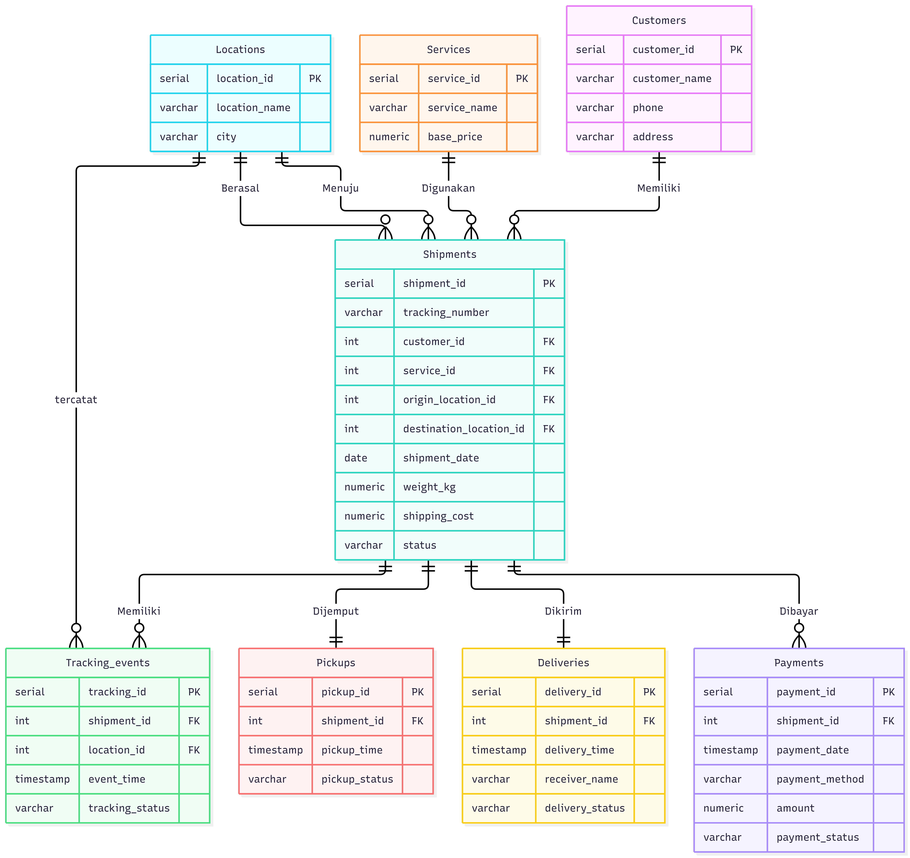

# UPS Logistics Database

Repository ini berisi database dummy bertema operasional United Parcel Service (UPS) yang dibuat untuk tugas mata kuliah **Kecerdasan Bisnis**.

Database dibuat menggunakan **PostgreSQL** dan dijalankan melalui **Docker**. Data yang digunakan merupakan data simulasi proses pengiriman paket, mulai dari pembuatan shipment, pickup, tracking, pembayaran, hingga delivery.

## Anggota Kelompok

- **Faisal Tanjung (2410817310012)**
- **Hafiz Perdana (2410817210027)**

## Database Design



Database terdiri dari **3 tabel master** dan **5 tabel transaksi**.

### Tabel Master

- `customers`
- `locations`
- `services`

### Tabel Transaksi

- `shipments`
- `pickups`
- `tracking_events`
- `payments`
- `deliveries`

## Penjelasan Singkat Database

Tabel `shipments` menjadi tabel transaksi utama yang menyimpan informasi pengiriman paket.

Setiap shipment terhubung dengan:

- `customers` untuk mengetahui customer yang melakukan pengiriman.
- `services` untuk mengetahui jenis layanan pengiriman yang digunakan.
- `locations` untuk menentukan lokasi asal dan lokasi tujuan pengiriman.

Proses pengiriman kemudian dicatat lebih lanjut melalui beberapa tabel transaksi lainnya.

`pickups` digunakan untuk mencatat proses pengambilan paket.

`tracking_events` digunakan untuk mencatat perkembangan perjalanan paket beserta lokasi dan status tracking.

`payments` digunakan untuk mencatat transaksi pembayaran dari setiap shipment.

`deliveries` digunakan untuk mencatat proses pengiriman akhir kepada penerima.

Secara sederhana, alur utama database adalah:

```text
Customer
   |
   v
Shipment
   |
   +----> Pickup
   |
   +----> Tracking Event
   |
   +----> Payment
   |
   +----> Delivery
```

## Struktur File

```text
ups-bi-db/
|
|-- .gitignore
|-- compose.yaml
|-- ERD_OLTP_UPS_Logistics.png
|-- init.sql
|-- seed.sql
|-- queries.sql
|-- query.md
|-- ups_logistics.sql
|-- README.md
```

Keterangan:

- `compose.yaml` digunakan untuk menjalankan PostgreSQL melalui Docker.
- `init.sql` berisi pembuatan tabel dan relasi database.
- `seed.sql` berisi data dummy untuk mengisi database.
- `queries.sql` berisi kumpulan query latihan dan analisis database.
- `query.md` berisi panduan dan penjelasan query.
- `ERD_OLTP_UPS_Logistics.png` berisi desain ERD database.
- `ups_logistics.sql` merupakan backup database PostgreSQL.

## Cara Menjalankan Database

### 1. Clone Repository

```bash
git clone https://github.com/Fiezz65/ups-bi-db.git
```

### 2. Masuk ke Folder Project

```bash
cd ups-bi-db
```

### 3. Jalankan PostgreSQL Menggunakan Docker

Pastikan **Docker Desktop** sudah berjalan.

Kemudian jalankan:

```bash
docker compose up -d
```

Container PostgreSQL akan berjalan dengan nama:

```text
ups_postgres
```

Untuk memastikan container sudah berjalan, gunakan:

```bash
docker ps
```

## Konfigurasi PostgreSQL

Hubungkan PostgreSQL melalui pgAdmin menggunakan konfigurasi berikut:

```text
Host     : localhost
Port     : 5433
Username : postgres
Password : postgres
```

## Membuat Database

Pada pgAdmin, buat database baru dengan nama:

```text
ups_logistics
```

Setelah database berhasil dibuat, buka **Query Tool** pada database tersebut.

## Menjalankan File SQL

Jalankan file SQL dengan urutan berikut:

```text
1. init.sql
2. seed.sql
```

### init.sql

File `init.sql` digunakan untuk membuat seluruh tabel beserta primary key, foreign key, dan relasinya.

### seed.sql

File `seed.sql` digunakan untuk mengisi tabel dengan data dummy.

## Jumlah Data

Setelah `seed.sql` berhasil dijalankan, jumlah data yang dihasilkan adalah:

### Data Master

```text
customers            11
locations             8
services               3
```

### Data Transaksi

```text
shipments           1000
pickups             1000
tracking_events     3000
payments            1000
deliveries           700
```

Tabel `shipments` memiliki 1000 data dan menjadi salah satu tabel transaksi utama dalam database.

## Verifikasi Jumlah Data

Gunakan query berikut untuk mengecek jumlah data pada seluruh tabel transaksi:

```sql
SELECT 'shipments' AS table_name, COUNT(*) AS row_count
FROM shipments

UNION ALL

SELECT 'pickups', COUNT(*)
FROM pickups

UNION ALL

SELECT 'tracking_events', COUNT(*)
FROM tracking_events

UNION ALL

SELECT 'payments', COUNT(*)
FROM payments

UNION ALL

SELECT 'deliveries', COUNT(*)
FROM deliveries;
```

Hasil yang diharapkan:

```text
table_name          row_count
--------------------------------
shipments              1000
pickups                1000
tracking_events        3000
payments               1000
deliveries              700
```

## Status Shipment

Data shipment dibagi menjadi beberapa status:

```text
DELIVERED       700
IN_TRANSIT      200
CANCELLED       100
```

Untuk memeriksa jumlah shipment berdasarkan status:

```sql
SELECT
    status,
    COUNT(*) AS jumlah
FROM shipments
GROUP BY status
ORDER BY jumlah DESC;
```

## Query Database

File `queries.sql` berisi berbagai contoh query yang dapat digunakan untuk mencoba dan menganalisis database.

Beberapa contoh analisis yang dapat dilakukan antara lain:

- mencari shipment berdasarkan tracking number;
- mencari shipment milik customer tertentu;
- menghitung jumlah shipment setiap customer;
- mencari customer dengan pemesanan terbanyak;
- menghitung total nominal pembayaran setiap customer;
- mencari customer dengan total pembayaran terbesar;
- menghitung jumlah shipment berdasarkan service;
- menghitung shipment berdasarkan lokasi asal dan tujuan;
- melihat riwayat tracking suatu paket;
- melihat data pickup;
- melihat data payment;
- melihat data delivery;
- menghitung rata-rata biaya pengiriman;
- menghitung rata-rata berat paket;
- menghitung lama proses pengiriman.

Penjelasan masing-masing query tersedia pada file `query.md`.

## Backup Database

File:

```text
ups_logistics.sql
```

merupakan backup database yang dapat digunakan sebagai alternatif apabila ingin melakukan restore database tanpa menjalankan `init.sql` dan `seed.sql` secara manual.

## Catatan

Seluruh data yang digunakan dalam database ini merupakan **data dummy** yang dibuat untuk kebutuhan simulasi dan tugas perkuliahan.

Data tersebut bukan merupakan data operasional asli dari United Parcel Service (UPS).
