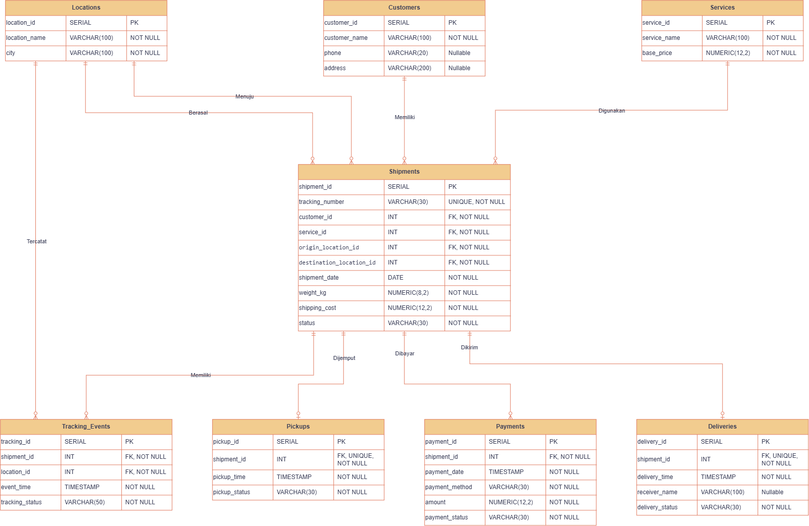
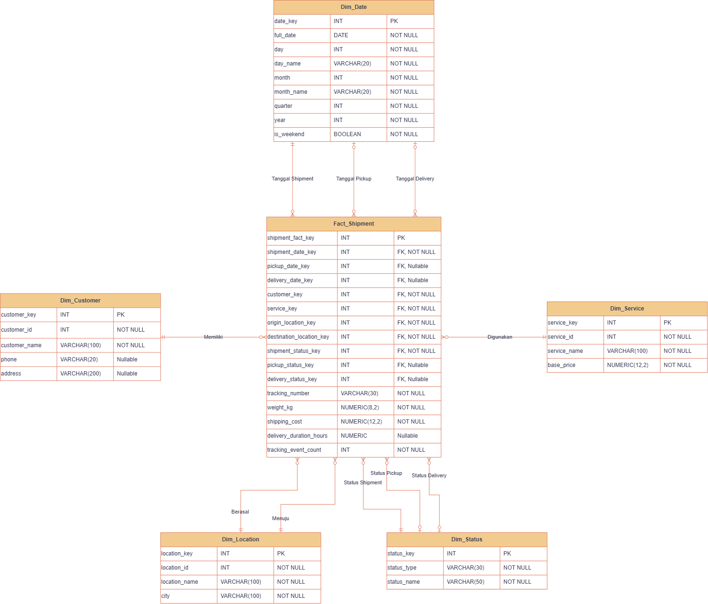
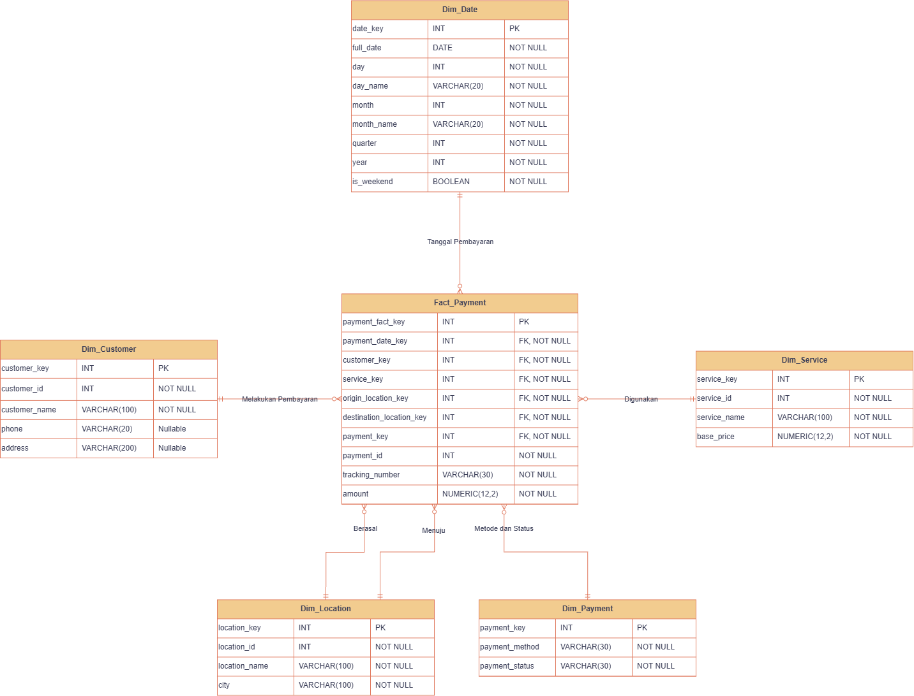

# UPS Logistics Database

Repository ini berisi database dummy bertema operasional UPS untuk tugas mata kuliah Kecerdasan Bisnis.

Database menggunakan PostgreSQL yang dijalankan melalui Docker. Project terdiri dari database OLTP dan hasil konversinya ke dimensional modeling menggunakan Star Schema.

## Anggota Kelompok

- Faisal Tanjung (2410817310012)
- Hafiz Perdana (2410817210027)

## OLTP Database Design

Database OLTP digunakan untuk menyimpan data transaksi operasional UPS Logistics.



### Tabel Master

- `customers`
- `locations`
- `services`

### Tabel Transaksi

- `shipments`
- `pickups`
- `tracking_events`
- `payments`
- `deliveries`

Tabel `shipments` menjadi transaksi utama yang menyimpan data pengiriman. Proses selanjutnya dicatat melalui `pickups`, `tracking_events`, `payments`, dan `deliveries`.

## Dimensional Modeling

Database OLTP kemudian dikonversi ke dimensional modeling untuk kebutuhan analisis data.

Dimensional modeling menggunakan dua Star Schema karena proses shipment dan payment memiliki grain yang berbeda.

### Shipment Star Schema

`Fact_Shipment` digunakan untuk analisis proses pengiriman, seperti jumlah shipment, customer, layanan, lokasi, status, biaya pengiriman, durasi pengiriman, dan jumlah tracking event.



### Payment Star Schema

`Fact_Payment` digunakan untuk analisis transaksi pembayaran berdasarkan customer, layanan, lokasi, tanggal, metode pembayaran, dan status pembayaran.



## Cara Menjalankan

### 1. Clone Repository

```bash
git clone https://github.com/Fiezz65/ups-bi-db.git
```

### 2. Masuk ke Folder Project

```bash
cd ups-bi-db
```

### 3. Jalankan PostgreSQL Melalui Docker

```bash
docker compose up -d
```

### 4. Hubungkan pgAdmin

Gunakan konfigurasi berikut:

```text
Host     : localhost
Port     : 5433
Username : postgres
Password : postgres
```

### 5. Buat Database

Buat database:

```text
ups_logistics
```

## Menjalankan OLTP

Jalankan file berikut secara berurutan:

```text
OLTP/init.sql
OLTP/seed.sql
```

`init.sql` digunakan untuk membuat tabel dan relasi database OLTP.

`seed.sql` digunakan untuk mengisi data dummy.

### Jumlah Data Transaksi OLTP

```text
shipments          1000
pickups            1000
tracking_events    3000
payments           1000
deliveries          700
```

Untuk mengecek jumlah data:

```sql
SELECT 'shipments' AS table_name, COUNT(*) AS total
FROM shipments

UNION ALL

SELECT 'pickups', COUNT(*)
FROM pickups

UNION ALL

SELECT 'tracking_events', COUNT(*)
FROM tracking_events

UNION ALL

SELECT 'payments', COUNT(*)
FROM payments

UNION ALL

SELECT 'deliveries', COUNT(*)
FROM deliveries;
```

## Menjalankan Dimensional Modeling

Setelah database OLTP selesai dibuat dan diisi, jalankan file berikut secara berurutan:

```text
DW/dw_init.sql
DW/dw_load.sql
```

`dw_init.sql` digunakan untuk membuat schema `dw`, dimension table, dan fact table.

`dw_load.sql` digunakan untuk mengambil data dari OLTP dan memasukkannya ke tabel dimension dan fact.

Data OLTP tetap berada pada schema `public`, sedangkan dimensional modeling berada pada schema `dw`.

Untuk mengecek jumlah data pada fact table:

```sql
SELECT COUNT(*) AS total_shipment
FROM dw.fact_shipment;

SELECT COUNT(*) AS total_payment
FROM dw.fact_payment;
```

Jumlah data utama yang diharapkan:

```text
fact_shipment    1000
fact_payment     1000
```

## Catatan

Seluruh data yang digunakan merupakan data dummy untuk kebutuhan tugas dan bukan data operasional asli UPS.