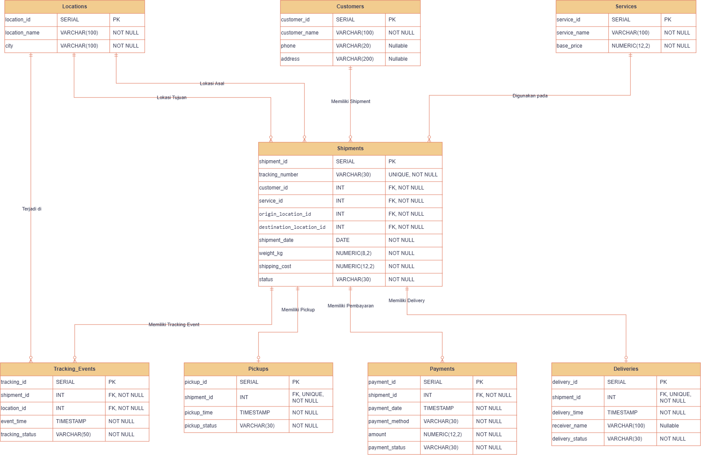

# UPS Logistics Data Warehouse

Repository ini merupakan project tugas mata kuliah **Kecerdasan Bisnis** dengan studi kasus UPS Logistics.

Project menggunakan database OLTP sebagai sumber data, kemudian data diproses melalui ETL berbasis Python dan dimuat ke Data Warehouse dengan pendekatan dimensional modeling. Proses ETL diorkestrasi dan dijadwalkan menggunakan **Apache Airflow** sebagai pengganti cron pada tahap sebelumnya.

## Anggota Kelompok

- Faisal Tanjung  (2410817310012)
- Hafiz Perdana   (2410817210027)

## Arsitektur

Arsitektur yang digunakan terdiri dari tiga bagian utama:

```text
PostgreSQL Lokal
ups_logistics
(OLTP)
      |
      | Extract
      v
Apache Airflow (Docker)
DAG: ups_logistics_etl
check_connection -> extract -> transform -> load_dimension -> load_fact -> validate
      |
      | Load
      v
PostgreSQL Lokal
ups_logistics_dw
(Data Warehouse)
```

Database OLTP dan Data Warehouse berjalan pada PostgreSQL lokal, sedangkan Apache Airflow dijalankan melalui Docker. Airflow terdiri dari dua container:

- `airflow`: Airflow mode standalone (scheduler, web UI, dan DAG processor)
- `airflow-metadb`: PostgreSQL khusus untuk menyimpan metadata internal Airflow (riwayat eksekusi dan status task), bukan OLTP maupun Data Warehouse

## Struktur Repository

```text
ups-bi-db/
├── OLTP/        # skema, data dummy, dan ERD database OLTP
├── DW/          # skema Data Warehouse, star schema, acceptance test, dan report
├── ETL/         # ETL Python + cron (tahap sebelumnya)
├── AIRFLOW/     # orkestrasi ETL dengan Apache Airflow
│   ├── docker-compose.yml
│   ├── verification_queries.sql
│   └── dags/
│       ├── ups_etl_dag.py
│       └── etl_functions.py
├── compose.yaml
└── .env.example
```

## OLTP Database

Database `ups_logistics` digunakan sebagai sumber data operasional.

Tabel yang digunakan:

### Master

- `customers`
- `locations`
- `services`

### Transaksi

- `shipments`
- `pickups`
- `tracking_events`
- `payments`
- `deliveries`

`shipments` menjadi tabel transaksi utama yang menghubungkan customer, service, lokasi asal, dan lokasi tujuan. Proses pengiriman selanjutnya dicatat melalui pickup, tracking event, payment, dan delivery.

### Jumlah Data

| Tabel | Jumlah |
|---|---:|
| customers | 11 |
| locations | 8 |
| services | 3 |
| shipments | 1000 |
| pickups | 1000 |
| tracking_events | 3000 |
| payments | 1000 |
| deliveries | 700 |

## ERD OLTP



## Data Warehouse

Data Warehouse menggunakan pendekatan dimensional modeling dengan **2 fact table dan 8 dimension table**.

### Fact Table

- `fact_shipment`
- `fact_payment`

### Dimension Table

- `dim_date`
- `dim_customer`
- `dim_service`
- `dim_location`
- `dim_shipment_status`
- `dim_pickup_status`
- `dim_delivery_status`
- `dim_payment`

## Business Process dan Grain

### Fact Shipment

Business process yang dianalisis adalah proses pengiriman paket.

**Grain:** satu row pada `fact_shipment` merepresentasikan satu transaksi shipment.

Measure yang digunakan:

- `weight_kg`
- `shipping_cost`
- `delivery_duration_hours`
- `tracking_event_count`

### Fact Payment

Business process yang dianalisis adalah transaksi pembayaran pada shipment.

**Grain:** satu row pada `fact_payment` merepresentasikan satu transaksi pembayaran.

Measure yang digunakan:

- `amount`

## Shipment Star Schema

`fact_shipment` digunakan untuk menganalisis proses pengiriman berdasarkan customer, service, tanggal, lokasi, dan status pengiriman.


## Payment Star Schema

`fact_payment` digunakan untuk menganalisis transaksi pembayaran berdasarkan customer, service, tanggal, lokasi, metode pembayaran, dan status pembayaran.


## ETL

Proses ETL dibuat menggunakan Python. Logika ETL (extract, transform, load dimension, load fact) berada pada `ETL/etl.py` dan dipakai kembali oleh Airflow melalui `AIRFLOW/dags/etl_functions.py`.

Alur ETL:

```text
OLTP
  |
  v
Extract
  |
  v
Transform
  |
  v
Load Dimension
  |
  v
Load Fact
  |
  v
Data Warehouse
```

### Extract

ETL membaca data dari tabel OLTP dan mencatat beberapa metric:

- jumlah row
- duration
- throughput

Pengujian extract dilakukan minimal tiga kali untuk melihat konsistensi proses.

### Transform

Transform test yang digunakan terdiri dari:

1. Validasi tipe data tanggal
2. Null handling delivery
3. Deduplication customer
4. Normalisasi status

Setiap rule menampilkan nilai `Before`, `Expected`, `Actual`, dan `Status`.

### Load

Dimension dimuat terlebih dahulu sebelum fact.

Fact menggunakan surrogate key dari dimension yang sesuai. Proses load juga dibuat agar dapat dijalankan ulang tanpa menambahkan transaksi fact yang sama.

## Orkestrasi ETL dengan Apache Airflow

Pada tahap ini, penjadwalan ETL yang sebelumnya menggunakan cron digantikan oleh **Apache Airflow**. Airflow tidak menulis ulang logika ETL, melainkan memecah fungsi ETL yang sudah ada menjadi beberapa task yang dijalankan berurutan.

### DAG `ups_logistics_etl`

| Task | Keterangan |
|---|---|
| `check_connection` | Memastikan koneksi ke database OLTP dan Data Warehouse |
| `extract` | Membaca 8 tabel OLTP dan mencatat jumlah row, duration, dan throughput |
| `transform` | Menjalankan 4 transform test |
| `load_dimension` | Memuat 8 dimension table |
| `load_fact` | Memuat `fact_shipment` dan `fact_payment` |
| `validate` | Memastikan fact tidak kosong dan tidak ada duplikasi |

Konfigurasi DAG:

| Pengaturan | Nilai | Keterangan |
|---|---|---|
| `schedule` | `*/5 * * * *` | Dijalankan otomatis setiap 5 menit |
| `catchup` | `False` | Jadwal yang terlewat tidak dijalankan ulang |
| `max_active_runs` | `1` | Tidak ada dua eksekusi yang berjalan bersamaan |
| `retries` | `1` | Task yang gagal dicoba ulang satu kali |

Karena setiap task Airflow berjalan sebagai proses terpisah, hasil extract dan transform disimpan sementara sebagai file staging (`AIRFLOW/staging/`) agar dapat dibaca oleh task berikutnya.

### Perbandingan Cron dan Airflow

| Aspek | Cron | Apache Airflow |
|---|---|---|
| Struktur | Satu script | Dipecah menjadi beberapa task |
| Status | Tidak diketahui berhasil atau gagal | Setiap task memiliki status |
| Kegagalan | Tidak ada retry | Retry otomatis |
| Gagal di tengah | Tahap berikutnya tetap berjalan | Tahap berikutnya dihentikan |
| Log | Satu file `cron.log` | Terpisah per task dan per eksekusi |
| Pemantauan | Melalui terminal | Melalui dashboard web |

## Cara Menjalankan

### 1. Clone Repository

```bash
git clone https://github.com/Fiezz65/ups-bi-db.git
cd ups-bi-db
```

### 2. Buat Database OLTP

Buat database PostgreSQL lokal:

```text
ups_logistics
```

Kemudian jalankan secara berurutan:

```text
OLTP/init.sql
OLTP/seed.sql
```

`init.sql` digunakan untuk membuat tabel dan relasi OLTP, sedangkan `seed.sql` digunakan untuk mengisi data dummy.

### 3. Buat Database Data Warehouse

Buat database PostgreSQL lokal:

```text
ups_logistics_dw
```

Kemudian jalankan:

```text
DW/dw_init.sql
```

File tersebut membuat schema `dw`, dimension table, fact table, primary key, dan foreign key yang digunakan pada Data Warehouse.

### 4. Konfigurasi Environment

Salin file:

```text
.env.example
```

menjadi:

```text
.env
```

Kemudian sesuaikan konfigurasi koneksi PostgreSQL lokal.

File `.env` digunakan untuk menyimpan konfigurasi koneksi source OLTP dan target Data Warehouse dan tidak disimpan ke repository. File yang sama digunakan oleh ETL berbasis cron maupun Apache Airflow.

### 5. Menjalankan Apache Airflow

Pastikan Docker Desktop dan PostgreSQL lokal sudah berjalan, serta container ETL berbasis cron tidak sedang aktif:

```bash
docker stop ups_etl
```

Jalankan Airflow:

```bash
cd AIRFLOW
docker compose up -d
docker compose ps
```

Ambil password login admin (PowerShell):

```powershell
docker compose logs airflow | Select-String "Password for user"
```

Buka dashboard Airflow:

```text
http://localhost:8080
```

Login dengan username `admin` dan password yang diperoleh, kemudian aktifkan DAG `ups_logistics_etl`. DAG akan berjalan otomatis setiap 5 menit, atau dapat dijalankan manual melalui tombol **Trigger**.

Jika berhasil, seluruh task berstatus **Success** dan log task `validate` menampilkan:

```text
=== VALIDASI DATA WAREHOUSE ===
fact_shipment          : 1000
fact_payment           : 1000
duplicate fact_shipment: 0
duplicate fact_payment : 0
Status                 : SUCCESS
```

Untuk menghentikan Airflow:

```bash
docker compose stop
```

### 6. ETL dengan Cron (Tahap Sebelumnya)

Pada tahap sebelumnya, ETL dijalankan menggunakan cron di dalam Docker.

Build service ETL:

```bash
docker compose build --no-cache etl
```

Menjalankan ETL secara manual:

```bash
docker compose run --rm etl python /app/etl.py
```

Menjalankan cron scheduler (setiap satu menit):

```bash
docker compose up -d etl
```

Konfigurasi cron:

```text
* * * * * root /bin/sh /app/run_etl.sh >> /app/logs/cron.log 2>&1
```

Untuk melihat log ETL otomatis:

```bash
docker exec -it ups_etl tail -n 120 /app/logs/cron.log
```

## Validasi Data Warehouse

Pengujian Data Warehouse tersedia pada:

```text
DW/acceptance_test.sql
AIRFLOW/verification_queries.sql
```

Pengujian mencakup:

- duplicate fact
- orphan foreign key
- join fact dengan dimension
- penggunaan date dimension
- jumlah baris dimension dan fact

Hasil yang diharapkan:

```text
Duplicate Fact = 0
Orphan Foreign Key = 0
```

Proses ETL juga diuji dengan rerun menggunakan source yang sama. Jumlah data fact harus tetap sama dan tidak menghasilkan duplicate load, baik saat dijalankan manual maupun terjadwal oleh Airflow.

Jumlah data utama setelah ETL:

```text
fact_shipment = 1000
fact_payment  = 1000
```

## Report Data Warehouse

Query report tersedia pada:

```text
DW/report_queries.sql
```

Report yang digunakan:

1. Jumlah shipment dan total biaya pengiriman per bulan
2. Jumlah shipment dan total biaya pengiriman per customer
3. Ringkasan pembayaran berdasarkan metode dan status pembayaran

## Catatan

Seluruh data yang digunakan merupakan data dummy untuk kebutuhan tugas dan bukan data operasional asli UPS.